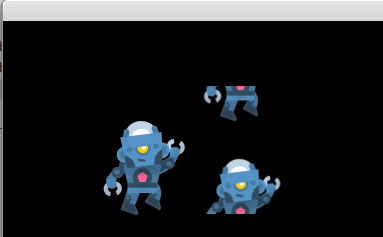

# Experiment 1 - Scrolling Texture

Old games used a technique to animate textures where they shifted the sprite one
row or column per frame. An easy/cheesy way to do this is to just produce a set
of sprites that are shifted already and treat them as individual frames.

I want to see if there's a way to do it without duplicating and modifying the
sprite. I'm thinking that ancient platforms (think Commodore C=64 or Apple ][)
wouldn't have the memory to waste for this sort of thing.

The goal is to do this with one draw call, rather than two.



You can run it from this directory with:

```sh
./python3 main.py
```

If you're using Sublime Text:

1. Open the project.
1. Under Tools -> Build System, choose "Python Arcade". You only need to pick
   the build system once, it's stored in the workspace file.
1. Choose Tools -> Build or press its shortcut (Ctrl+B).

Press Escape to exit the demo.

## Credits

This is written in Python 3, using the [Arcade](https://arcade.academy/) 2D
game engine.

### Graphics

* `character_robot_jump.png` - From Kenney.nl's freely usable
  [Toon Characters 1](https://kenney.nl/assets/toon-characters-1) collection.
* `character_robot_jump-2y.png` - Kenny.nl's robot sprite, tiled using
  `montage` from ImageMagick:

  ``` sh
  montage character_robot_jump.png character_robot_jump.png -tile 1x2 -background none character_robot_jump-2y.png
  ```
